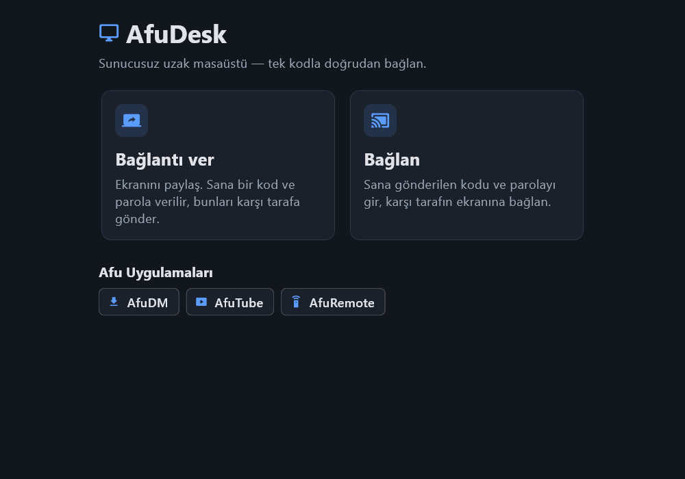
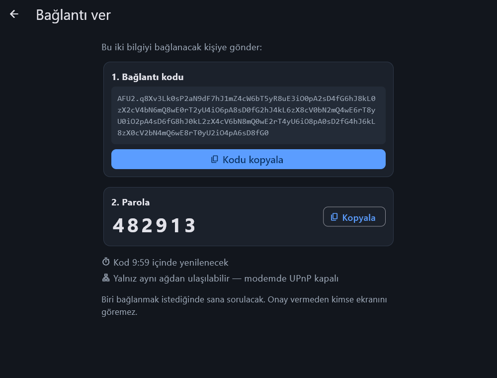
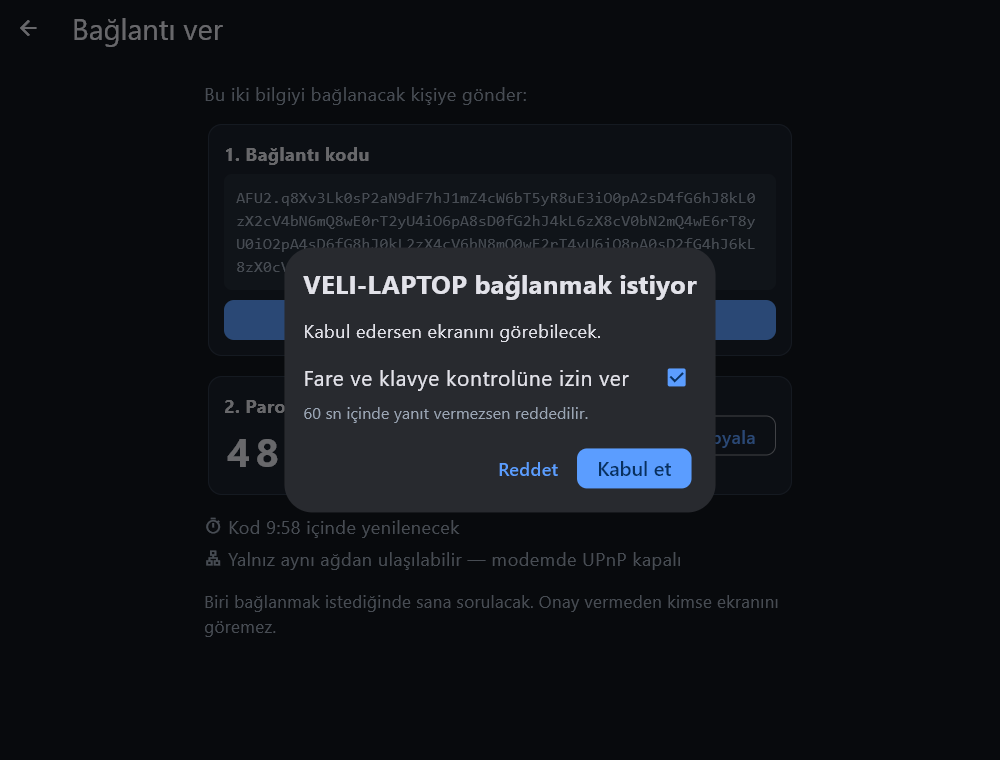
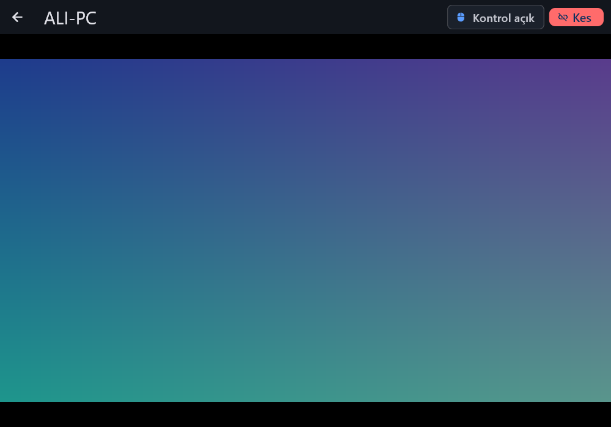

# AfuDesk

**Türkçe** · [English](#english)

AfuDesk, iki bilgisayarı **hiçbir sunucu olmadan** birbirine bağlayan açık kaynak bir uzak masaüstü uygulamasıdır. Bağlantı veren cihaz kendi bağlantı noktasını açar; adreslerini parolayla şifrelenmiş tek bir koda koyar. Karşı taraf bu kodu ve parolayı girip doğrudan bağlanır. Arada kimsenin sunucusu, hesabı ya da ücreti yoktur.



## Nasıl kullanılır

**Ekranını paylaşacak kişi**
1. AfuDesk'i aç, **Bağlantı ver**'e bas.
2. Çıkan **kodu** ve **parolayı** karşı tarafa gönder (ör. WhatsApp).
3. Karşı taraf bağlanmak istediğinde bir pencere açılır. İstersen fare/klavye iznini kapat, **Kabul et**'e bas.

**Bağlanacak kişi**
1. AfuDesk'i aç, **Bağlan**'a bas.
2. Kodu yapıştır, parolayı yaz, **Bağlan**'a bas.
3. Karşı taraf kabul edince ekranı görürsün; izin verildiyse fare ve klavyeyi kullanabilirsin.

| Bağlantı ver | Gelen istek | Uzak ekran |
|---|---|---|
|  |  |  |

## Kurulum

[GitHub Releases](https://github.com/pirncedark/afudesk/releases) sayfasından `AfuDesk-windows-x64.zip` dosyasını indir, bir klasöre çıkar ve `afudesk.exe`'yi çalıştır. Windows 10/11 (64 bit) gerekir. Kurulum yoktur; klasörü silmek kaldırmak için yeterlidir.

İlk açılışta Windows Güvenlik Duvarı izin isteyebilir: **Özel ağlar** için izin ver.

## Hangi durumda çalışır?

AfuDesk'te merkezi sunucu olmadığı için bağlantı veren cihaza **doğrudan ulaşılabilmesi** gerekir:

| Durum | Çalışır mı |
|---|---|
| İki cihaz aynı ağda (ev/ofis Wi‑Fi) | ✅ Her zaman |
| Bağlantı veren tarafın modeminde UPnP açık | ✅ İnternet üzerinden |
| Bağlantı veren tarafta genel IPv6 var | ✅ İnternet üzerinden |
| Operatör CGNAT kullanıyor / çift modem, UPnP ve IPv6 yok | ❌ İnternet üzerinden bağlanılamaz |

Uygulama bağlantı verirken hangi durumda olduğunu ekranda yazar ("İnternetten ulaşılabilir" ya da "Yalnız aynı ağdan ulaşılabilir").

## Güvenlik

- Kod, parolayla **Argon2id** (64 MiB) + **XChaCha20‑Poly1305** kullanılarak şifrelenir. Parolasız kod okunamaz ve değiştirilemez.
- Bağlantı **QUIC/TLS 1.3** ile şifrelidir. Her oturumda yeni bir sertifika üretilir. Karşı tarafın sertifikası koddaki parmak iziyle doğrulanır, böylece araya girme (MITM) engellenir.
- Kod **10 dakika** geçerlidir ve **tek kullanımlıktır**. Oturum bitince yeni kod üretilir.
- Onay vermeden kimse ekranını göremez. Fare/klavye kontrolü ayrı bir izindir.

## Afu ailesi

- [AfuDM](https://github.com/pirncedark/AfuDM) — indirme yöneticisi (Windows)
- [AfuTube](https://github.com/pirncedark/AfuDM/releases?q=afutube) — video indirici (Android)
- [AfuRemote](https://github.com/pirncedark/AfuRemote) — telefondan TV kumandası

## Geliştirme

Yapı: `rust/` çekirdek (ağ, kod, görüntü, girdi) · `app/` Flutter arayüzü · `app/kopru/` flutter_rust_bridge köprüsü.

```bash
cd rust && cargo test            # 38 test (uçtan uca QUIC dahil)
cd app && flutter test           # 27 arayüz testi
cd app && flutter test integration_test -d windows   # gerçek motor + ekran görüntüleri
cd app && flutter build windows --release
```

Gerekenler: Rust (stable, MSVC), Flutter **3.44.9**, Visual Studio Build Tools (C++). Not: Flutter 3.47.5'in `flutter_tester`'ı bazı Windows makinelerinde rastgele çöküyor; bu yüzden sürüm 3.44.9'a sabitlendi.

Lisans: MIT

---

## English

AfuDesk is an open-source remote desktop app that connects two computers **without any server**. The sharing device opens its own endpoint and puts its addresses into a single password-encrypted code; the other side enters the code and password and connects directly.

**Share your screen:** open AfuDesk → **Bağlantı ver** (Give access) → send the code and password → approve the incoming request.
**Connect:** open AfuDesk → **Bağlan** (Connect) → paste the code, type the password → connect.

It works on the same network always, and over the internet when the sharing side has UPnP enabled on its router or a public IPv6 address. It cannot connect across the internet behind carrier-grade NAT without UPnP/IPv6.

Security: Argon2id + XChaCha20-Poly1305 encrypted code, QUIC/TLS 1.3 with per-session certificate pinned by fingerprint, single-use 10-minute codes, explicit approval with a separate control permission.

Download `AfuDesk-windows-x64.zip` from [Releases](https://github.com/pirncedark/afudesk/releases). License: MIT.
