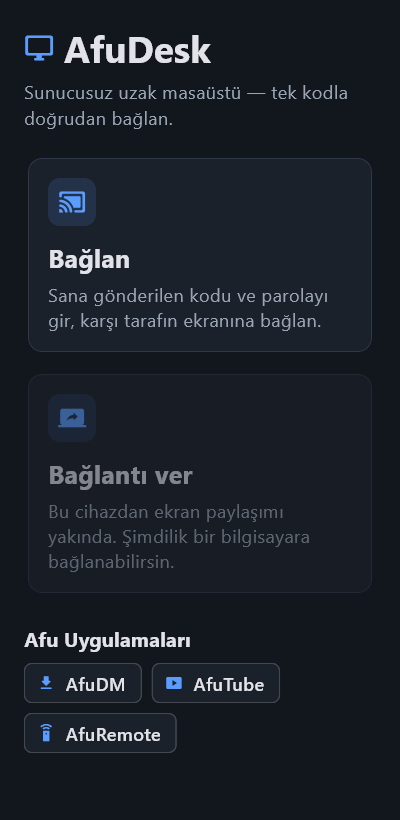

# AfuDesk

**English** · [Türkçe](#türkçe)

AfuDesk is an open-source remote desktop app that connects two computers **without any server**. The device that shares its screen opens its own connection point and puts its addresses into a single password-encrypted code. The other side enters the code and the password and connects directly. There is no server, no account and no fee in between.

 

## How to use

**The person sharing the screen**
1. Open AfuDesk and choose **Bağlantı ver** (Give access).
2. Send the **code** and the **password** to the other person (for example on WhatsApp).
3. When they try to connect, a dialog appears. Turn off mouse/keyboard control if you like, then choose **Kabul et** (Accept).

**The person connecting**
1. Open AfuDesk and choose **Bağlan** (Connect).
2. Paste the code, type the password and choose **Bağlan**.
3. Once the other side accepts, you see their screen; if control was allowed, you can use the mouse and keyboard.

| Give access | Incoming request | Remote screen |
|---|---|---|
|  |  |  |

## Install

Download `AfuDesk-windows-x64.zip` from [GitHub Releases](https://github.com/pirncedark/afudesk/releases), extract it to a folder and run `afudesk.exe`. Requires Windows 10/11 (64-bit). There is no installer; deleting the folder removes the app.

On first launch Windows Firewall may ask for permission: allow **Private networks**.

**Android (viewer):** download `AfuDesk-android.apk` from the same page and install it (allow "install unknown apps" for your browser or file manager). Android 7.0+. On the phone you can connect to a computer: tap = left click, long press = right click, drag = drag, two fingers = scroll; the **Keyboard** button opens the phone keyboard. Sharing the phone's own screen is not available yet.

### Use your phone as a gamepad

Connect a Bluetooth gamepad to the Android phone, or open a remote session and tap **🎮 Oyun kolu** to use the on-screen controls. The host must grant gamepad permission. To verify it, accept the session with gamepad permission and check `joy.cpl` on the host: a second Xbox 360 controller should appear. Move both sticks and press the buttons to test input; trigger vibration to check phone/controller haptics.

## When does it work?

Because AfuDesk has no central server, the sharing device must be **directly reachable**:

| Situation | Works? |
|---|---|
| Both devices on the same network (home/office Wi‑Fi) | ✅ Always |
| UPnP enabled on the sharing side's router | ✅ Over the internet |
| The sharing side has a public IPv6 address | ✅ Over the internet |
| Carrier-grade NAT / double NAT, no UPnP and no IPv6 | ❌ Not over the internet |

While giving access, the app shows which case applies ("Reachable from the internet" or "Reachable only from the same network").

## Oyun Modu

Game Mode makes a remote gamepad appear on the host as a virtual Xbox controller. Install the [ViGEmBus driver](https://github.com/nefarius/ViGEmBus/releases) before using it on Windows.

## Pano

Clipboard sharing can send copied text in both directions when the host grants permission. It is disabled by default and only shares text changes made after permission is granted.

## Security

- The code is encrypted with the password using **Argon2id** (64 MiB) + **XChaCha20‑Poly1305**. Without the password the code cannot be read or changed.
- The connection uses **QUIC/TLS 1.3**. A new certificate is created for every session, and the other side's certificate is checked against the fingerprint inside the code, which prevents man-in-the-middle attacks.
- A code is valid for **10 minutes** and works **once**; a new code is created after each session.
- Nobody can see your screen without your approval. Mouse/keyboard control is a separate permission.

## Afu family

- [AfuDM](https://github.com/pirncedark/AfuDM) — download manager (Windows)
- [AfuTube](https://github.com/pirncedark/AfuDM/releases?q=afutube) — video downloader (Android)
- [AfuRemote](https://github.com/pirncedark/AfuRemote) — phone as TV remote (Android)

## Development

Layout: `rust/` core (network, code, video, input) · `app/` Flutter UI · `app/kopru/` flutter_rust_bridge bridge.

```bash
cd rust && cargo test            # core tests (including end-to-end QUIC)
cd app && flutter test           # UI tests
cd app && flutter test integration_test -d windows   # real engine + screenshots
cd app && flutter build windows --release
```

Requirements: Rust (stable, MSVC), Flutter **3.44.9**, Visual Studio Build Tools (C++). Note: the `flutter_tester` of Flutter 3.47.5 crashes randomly on some Windows machines, so the version is pinned to 3.44.9.

License: MIT

---

## Türkçe

AfuDesk, iki bilgisayarı **hiçbir sunucu olmadan** birbirine bağlayan açık kaynak bir uzak masaüstü uygulamasıdır. Ekranını paylaşan cihaz kendi bağlantı noktasını açar ve adreslerini parolayla şifrelenmiş tek bir koda koyar. Karşı taraf bu kodu ve parolayı girip doğrudan bağlanır. Arada kimsenin sunucusu, hesabı ya da ücreti yoktur.

## Nasıl kullanılır

**Ekranını paylaşacak kişi**
1. AfuDesk'i aç, **Bağlantı ver**'e bas.
2. Çıkan **kodu** ve **parolayı** karşı tarafa gönder (ör. WhatsApp).
3. Karşı taraf bağlanmak istediğinde bir pencere açılır. İstersen fare/klavye iznini kapat, **Kabul et**'e bas.

**Bağlanacak kişi**
1. AfuDesk'i aç, **Bağlan**'a bas.
2. Kodu yapıştır, parolayı yaz, **Bağlan**'a bas.
3. Karşı taraf kabul edince ekranı görürsün; izin verildiyse fare ve klavyeyi kullanabilirsin.

## Kurulum

[GitHub Releases](https://github.com/pirncedark/afudesk/releases) sayfasından `AfuDesk-windows-x64.zip` dosyasını indir, bir klasöre çıkar ve `afudesk.exe`'yi çalıştır. Windows 10/11 (64 bit) gerekir. Kurulum yoktur; klasörü silmek kaldırmak için yeterlidir.

İlk açılışta Windows Güvenlik Duvarı izin isteyebilir: **Özel ağlar** için izin ver.

**Android (izleyici):** aynı sayfadan `AfuDesk-android.apk` dosyasını indirip kur (tarayıcına ya da dosya yöneticine "bilinmeyen uygulamaları yükle" izni ver). Android 7.0 ve üzeri. Telefondan bir bilgisayara bağlanabilirsin: dokun = sol tık, uzun bas = sağ tık, sürükle = sürükleme, iki parmak = kaydırma; **Klavye** düğmesi telefon klavyesini açar. Telefonun kendi ekranını paylaşmak henüz yok.

### Telefonla oyun kolu

Bluetooth oyun kolunu Android telefona bağla ya da oturumda **🎮 Oyun kolu** düğmesine bas. Host oyun kolu izni vermelidir. Denemek için host'ta `joy.cpl` aç: ikinci bir Xbox 360 kolu görünmeli. İki çubuğu ve düğmeleri dene; titreşim gelince telefonun ve destekliyorsa Bluetooth kolunun titrediğini kontrol et.

## Hangi durumda çalışır?

AfuDesk'te merkezi sunucu olmadığı için ekranını paylaşan cihaza **doğrudan ulaşılabilmesi** gerekir:

| Durum | Çalışır mı |
|---|---|
| İki cihaz aynı ağda (ev/ofis Wi‑Fi) | ✅ Her zaman |
| Paylaşan tarafın modeminde UPnP açık | ✅ İnternet üzerinden |
| Paylaşan tarafta genel IPv6 var | ✅ İnternet üzerinden |
| Operatör CGNAT / çift modem, UPnP ve IPv6 yok | ❌ İnternet üzerinden bağlanılamaz |

Uygulama bağlantı verirken hangi durumda olduğunu ekranda yazar ("İnternetten ulaşılabilir" ya da "Yalnız aynı ağdan ulaşılabilir").

## Oyun Modu

Oyun Modu'nda uzak oyun kolu, host'ta sanal bir Xbox kolu olarak görünür. Windows'ta kullanmadan önce [ViGEmBus sürücüsünü](https://github.com/nefarius/ViGEmBus/releases) kur.

## Pano

Pano paylaşımı, host izin verdiğinde kopyalanan metinleri iki yönde gönderebilir. Varsayılan olarak kapalıdır ve yalnızca izin verildikten sonra yapılan metin değişikliklerini paylaşır.

## Güvenlik

- Kod, parolayla **Argon2id** (64 MiB) + **XChaCha20‑Poly1305** kullanılarak şifrelenir. Parola olmadan kod okunamaz ve değiştirilemez.
- Bağlantı **QUIC/TLS 1.3** ile şifrelidir. Her oturumda yeni bir sertifika üretilir; karşı tarafın sertifikası koddaki parmak iziyle doğrulanır, böylece araya girme (MITM) engellenir.
- Kod **10 dakika** geçerlidir ve **tek kullanımlıktır**; her oturumdan sonra yeni kod üretilir.
- Onay vermeden kimse ekranını göremez. Fare/klavye kontrolü ayrı bir izindir.

## Afu ailesi

- [AfuDM](https://github.com/pirncedark/AfuDM) — indirme yöneticisi (Windows)
- [AfuTube](https://github.com/pirncedark/AfuDM/releases?q=afutube) — video indirici (Android)
- [AfuRemote](https://github.com/pirncedark/AfuRemote) — telefondan TV kumandası (Android)

## Geliştirme

Yapı: `rust/` çekirdek (ağ, kod, görüntü, girdi) · `app/` Flutter arayüzü · `app/kopru/` flutter_rust_bridge köprüsü. Komutlar ve gereksinimler için yukarıdaki İngilizce **Development** bölümüne bak. Flutter sürümü 3.44.9'a sabitlidir.

Lisans: MIT
